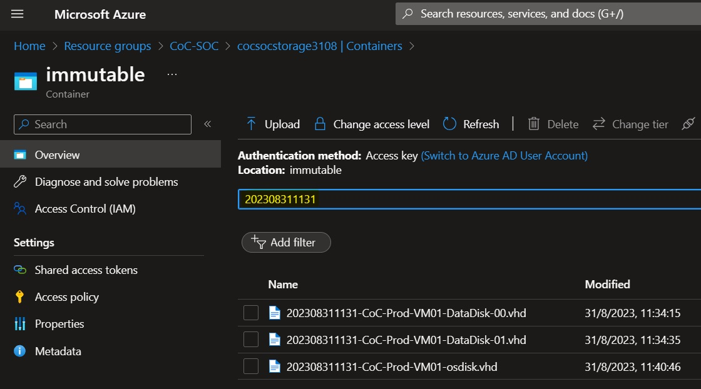
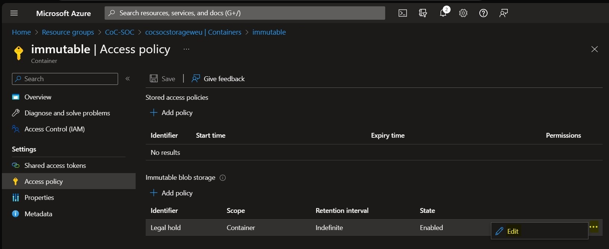

# CoC LAB Deployment
This guide details the process of deploying the LAB environment for the [Computer Forensics Chain of Custody in Azure](https://learn.microsoft.com/en-us/azure/architecture/example-scenario/forensics/)

[](https://portal.azure.com/#create/Microsoft.Template/uri/https%3A%2F%2Fraw.githubusercontent.com%2FAzure%2Fforensics%2Fmain%2F.armtemplate%2Fcoc-main.json)

To initiate the deployment of the LAB environment, verify to have the *Owner* role on the subscription then click on the **Deploy to Azure** button provided above. This action will trigger the deployment process within the Azure Portal. You will be prompted to provide the following parameters:

> [!NOTE]
> For resources such as storage accounts, key vaults, etc., which necessitate globally unique names, kindly replace the \<UNIQUESTRING> placeholder with a unique string of your choice, following the resource's constraints (e.g., maximum character count, lowercase only, etc.).

| Parameter | Description | Default value |
|-----------|-------------|---------------|
|Subscription|The subscription where the resource groups will be deployed|Current subscription|
|Region|The region where the deployment start. NOTE: All the resources will be deployed in the region defined in the *Coc-Location* paramter below||
|Coc-Location|The region where the resources will be deployed.|italynorth|
|Coc-prod-rg_name |The name of the resource group for the Production environment|CoC-Production|
|Coc-prod-vnet_name |The name of the virtual network for the Production environment|CoC-Production-vnet|
|Coc-prod-nsg_name |The name of the network security group for the Production environment|CoC-Production-vnet-server-nsg|
|Coc-prod-keyvault_name |The name of the key vault for the Production environment|CoC-Production-KV-\<UNIQUESTRING>|
|Coc-prod-VM01_name |The name of the VM for the Production environment|CoC-Prod-VM01|
|Coc-prod-VM01_adminUsername |The name of the admin user for the VM for the Production environment|cocprodadmin|
|Coc-prod-VM01_adminPassword|The password of the admin user for the VM for the Production environment||
||||
|Coc-soc-rg_name |The name of the resource group for the SOC environment|CoC-SOC|
|Coc-soc-vnet_name |The name of the virtual network for the SOC environment|CoC-SOC-vnet|
|Coc-soc-nsg_name |The name of the network security group for the SOC environment|CoC-SOC-vnet-soc-subnet01-nsg|
|Coc-soc-keyvault_name |The name of the key vault for the SOC environment|CoC-SOC-KV-\<UNIQUESTRING>|
|Coc-soc-storageAccount_name |The name of the storage account for the SOC environment|cocsocstorage-\<UNIQUESTRING>|
|Coc-soc-LogAnWks_name |The name of the Log Analytics Workspace for the SOC environment|CoC-SOC-LA-\<UNIQUESTRING>|
|Coc-soc-automatioAccount_name |The name of the automation account for the SOC environment|CoC-SOC-AA-\<UNIQUESTRING>|
|CoC-SOC-workerGroup_name|The name of the Hybrid Worker Group for the SOC environment|CoC-HRW-Windows|
|Coc-soc-HRW_VM_name |The name of the Hybrid RunBook Worker VM for the SOC environment|CoC-SOC-HRW|
|Coc-soc-HRW_adminUsername |The name of the admin user for the Hybrid RunBook Worker VM for the SOC environment|cocsocadmin|
|Coc-soc-HRW_adminPassword |The password of the admin user for the Hybrid RunBook Worker VM for the SOC environment||


> [!NOTE]
> The deployment process is expected to take approximately 5 minutes to complete.


## LAB environment description
The LAB environment represents a simplified version of the architecture described in the [article](https://learn.microsoft.com/en-us/azure/architecture/example-scenario/forensics/) deploying two resource groups within the same subscription. The first resource group simulates the **Production Environment**, housing Digital Evidence, while the second resource group holds the **SOC Environment**.


The Production resource group contains:
1. A **virtual network** containing a subnet and network security group for subnet protection.
1. A **Windows Server 2025 VM** featuring a public IP address, an OS disk, and two data disks configured with Azure Disk Encryption (ADE).
1. A **key vault** designed to store the BEK keys of the encrypted disks.

The SOC resource group contains:
1. A **virtual network** with a subnet and network security group for subnet protection.
1. A **Windows Server 2025 VM** functioning as a Hybrid RunBook Worker (HRW). The HRW is automatically configured with the necessary PowerShell modules for executing the Chain of Custody process.
1. A **storage account** for storing the digital evidence with:
    1. a blob container named *immutable* automatically configured with the [Legal Hold](https://docs.microsoft.com/en-us/azure/storage/blobs/storage-blob-immutability-policies-overview) feature
    1. a file share named *hash* used for calculating digital evidence hashes.
1. A **key vault** for storing, in the SOC environment, a copy of the BEK keys and the hash of the digital evidence processed.
1. A **Log Analytics Workspace** for storing the logs of the Azure resources involved in the Chain of Custody process.
1. An **automation account** configured with:
    1. A RunBook implementing the Chain of Custody process as outlined in the [article](https://learn.microsoft.com/en-us/azure/architecture/example-scenario/forensics/)
    1. Variables for the RunBook, automatically populated with SOC environment values.
    1. A System Managed Identity granted necessary permissions for both Production and SOC resource groups.
    1. An Hybrid Worker Group containing the Hybrid RunBook Worker (HRW) VM

## Executing the Chain of Custody process in the LAB environment
Access the automation account within the SOC resource group and navigate to the **RunBooks** blade. Select the **Copy-VmDigitalEvidenceWin** RunBook and click on the **Start** button. Within the **Start RunBook** blade specify the following parameters:

|Parameter|Description|Sample value|
|--------|-----------|------------|
|SUBSCRIPTION ID|The subscription ID where the Production resource group is deployed|xxxxxxxx-xxxx-xxxx-xxxx-xxxxxxxxxxxx|
|RESOURCEGROUPNAME|The name of the Production resource group|CoC-Production|
|VIRTUALMACHINENAME|The name of the VM in the Production resource group|CoC-Prod-VM01|
|CALCULATEHASH|If true the RunBook will calculate the hash of the digital evidence. Supported values are TRUE or FALSE| TRUE|
|HASHALGORITHM|The algorithm used to calculate the hash of the digital evidence. Supported Values are MD5, SHA256, SKEIN, KECCAK (or SHA3)|SHA3|

> [!NOTE]
> The RunBook applied to the LAB's deployed VM will take around 45 minutes to complete (or 15 minutes without hash calculation). Completion time depends on attached disk sizes. Hash calculation is time-intensive, executed via parallel jobs for faster processing across all disks.

Once the job concludes, examine the job's Output to verify successful completion.


The output shows the name of the digital evidence composed by a timestamp prefix followed by the name of the disk. For example the prefix for a job started on 31st August 2023 at 11:31 AM will be *202308311131_*.  
The digital evidence is stored in the *immutable* blob container of the storage account in the SOC resource group and can be downloaded for inspection.
> [!NOTE]
> Add your IP address to both the Key Vault firewall and the Storage Account firewall defined in the SOC resource group.


The hash of the digital evidence is stored in the Key Vault of the SOC stored with the same name of the digital evidence followed by the suffix "-hash" and the algorithm used. The BEK secrets are stored in the key vault of the SOC with the name of the digital evidence. 

After downloading digital evidence, recalculate the hash for comparison with the KeyVault-stored hash to verify integrity.

> [!NOTE]
> The [Appendix](#hash-utility) section below provides a PowerShell script to recalculate the hash of the digital evidence.

For digital evidence decryption, get the BEK keys from the SOC environment's Key Vault and follow instructions outlined in the [section](#windows-disks-unlock) below.

> [!NOTE]
> As the VM deployed in this LAB environment is a Windows Server, you can follow the instructions provided in the [Windows disk unlock](#windows-disks-unlock) section. If you wish to extend the LAB with a Linux VM that has ADE enabled, the [Linux disk unlock](#linux-disks-unlock) section  provides detailed steps for digital evidence decryption on Linux.
The sections assume that the optional KEK encryption is not used to wrap the BEK. For more information on how to unlock an encrypted disk for offline repair, please refer to https://learn.microsoft.com/en-us/troubleshoot/azure/virtual-machines/unlock-encrypted-disk-offline

#### Windows disks unlock

The Azure Windows disks are locked by BitLocker. Once the disk is attached on a Windows machine the content is not readable, until it's unlocked.

To unlock an Azure disk connected, for example, on G:\ execute below actions:

1. Open the SOC key vault, and search the secret containing the BEK of the disk. The secret is named with the timestamp prefix shown in the output of the RunBook execution

1. Copy the BEK secret value and paste it into the `$bekSecretBase64` variable in the following PowerShell script. Paste the value of the `DiskEncryptionKeyFileName` tag associated to the secret into the `$fileName` variable
1. Run the script

    ```powershell
    $bekSecretbase64="<paste the BEK string here>"
    $fileName="<paste the DiskEncryptionKeyFileName tag value here>"

    $bekFileBytes = [Convert]::FromBase64String($bekSecretbase64)
    $path = "C:\BEK\$fileName"
    [System.IO.File]::WriteAllBytes($path,$bekFileBytes)

    manage-bde -unlock G: -rk $path
    ```

#### Linux disks unlock

The Azure Linux disks are locked by DM-Crypt. The content of the disk is not accessible until the disk is unlocked.

To unlock an Azure disk and mount it under the directory `datadisk`:

1. Open the SOC key vault, and search the secret containing the BEK of the disk. The secret is named with the timestamp prefix shown in the output of the RunBook execution
1. Copy the BEK string and paste it into the `bekSecretBase64` variable in the following bash script
1. Run the script

    ```bash
   #!/bin/bash

   bekSecretbase64="<paste the BEK string here>"
   mountname="datadisk"
   device=$(blkid -t TYPE=crypto_LUKS -o device)
   passphrase="$(base64 -d <<< $bekSecretbase64)"

   echo "Passphrase: " $passphrase

   if [ ! -d "${mountname:+$mountname/}" ]; then
    mkdir $mountname
   fi

   cryptsetup open $device $mountname
    ```

After the script execution, you will be prompted for the encryption passphrase. Copy it from the script output to unlock and access the content of the Azure data disk.

## Remove the LAB environment

To remove the LAB environment, delete the resource groups created for the Production and SOC environments. Please note that to delete the SOC resource group, you must first allow your IP address through the Firewall of the storage account and delete the Legal Hold Access Policy from the *immutable* container in the storage account as shown in the screenshots below.




## Appendixes

### Hash utility

The provided  [zip file](https://github.com/Azure/forensics/raw/main/.utilities/Hash.zip) can be utilized to recalculate the hash file. It includes a PowerShell script and the corresponding DLL.

Run the *hash.ps1* Powershell script providing the following parameters:

**-FileList**: comma-separated list of files to be hashed <BR>
**-HashAlgorithm**: the algorithm used to calculate the hash of the digital evidence. Supported Values are *MD5, SHA256, SKEIN, KECCAK (or SHA3)*

This is a sample command to calculate the MD5 hash of 3 files:
```powershell
.\hash.ps1 -FileList "C:\temp\osdisk.vhd", "C:\temp\datadisk-00.vhd" ,"C:\temp\datadisk-01.vhd" -HashAlgorithm MD5   
```

### RunBook description

This section explains the actions that the RunBook performs to help you understand the CoC process and troubleshoot any issues.

The RunBook executes the PowerShell script [Copy-VmDigitalEvidenceWin_21.ps1](./.runbook/Copy-VmDigitalEvidenceWin_v21.ps1) which does the following:

1. Takes the subscription ID, the resource group name, and the virtual machine name of the VM to be processed as input parameters
1. Takes a boolean parameter to indicate whether to calculate the hash of the digital evidence and a string parameter to specify the hash algorithm to use (if applicable)
1. Reads information about the SOC environment stored in the following Automation Account variables:
    + '*destKV*': the name of the Key Vault in the SOC environment (sample value: 'CoC-SOC-KV-3108')
    + '*destRGName*': the name of the resource group in the SOC environment (sample value: 'CoC-SOC')
    + '*destSAblob*': the name of the storage account in the SOC environment containing the blob container named immutable(sample value: 'cocsocstorage3108')
    + '*destSAfile*': the name of the storage account in the SOC environment containing the files share for hash calculation. It can coincide with the storage account containing the blob container above (sample value: 'cocsocstorage3108')
    + '*destSubId*': the subscription ID of the SOC environment (sample value: 'xxxxxxxx-xxxx-xxxx-xxxx-xxxxxxxxxxxx')
1. Signs in to Azure with the System Managed Identity of the automation account
1. Creates temporary snapshots of the OS disk and Data disks of the virtual machine
1. Copies the snapshots to the SOC Azure Blob container named *immutable*
1. If virtual machine's disks are encrypted with Azure Disk Encryption (ADE), copies the BEK keys of the disks to the SOC key vault. A secret named with the timestamp of the RunBook execution contains the encryption key and all the tags to identify the disk and volume
1. If hash calculation is requested then:
    a. Copies the snapshots to the SOC Azure file share named *hash*
    b. Calculates the hash of the snapshots stored on the file share using the specified algorithm
    c. Stores the calculated hash value into the SOC key vault
    d. Removes the temporary copy of the snapshot from the SOC Azure file share
1. Deletes all the source snapshots generated during the process

> [!NOTE]
> The RunBook performs the actions above with the System Managed Identity of the automation account. The identity has been granted the necessary permissions to access both Production and SOC resource groups during deployment process of LAB environment described in this guide. If you want to implement complete solution described in the [article](https://learn.microsoft.com/en-us/azure/architecture/example-scenario/forensics/), using different subscriptions and resource groups, please make sure that System Managed Identity of automation account has following permissions:
>- *Contributor*: on the Production resource group of the virtual machine to be processed (needed to create the snapshots)
>- *Key Vault Secrets User*: on the Production Key Vault holding the BEK keys (needed to read  the BEK keys)
>
>Additionally, if the Key Vault has the firewall enabled, ensure that the public IP address of the Hybrid RunBook Worker VM is allowed through the firewall.

> [DISCLAIMER]
> The sample scripts are not supported under any Microsoft standard support program or service. The sample scripts are provided AS IS without warranty of any kind. Microsoft further disclaims all implied warranties including, without limitation, any implied warranties of merchantability or of fitness for a particular purpose. The entire risk arising out of the use or performance of the sample scripts and documentation remains with you. In no event shall Microsoft, its authors, or anyone else involved in the creation, production, or delivery of the scripts be liable for any damages whatsoever (including, without limitation, damages for loss of business profits, business interruption, loss of business information, or other pecuniary loss) arising out of the use of or inability to use the sample scripts or documentation, even if Microsoft has been advised of the possibility of such damages.